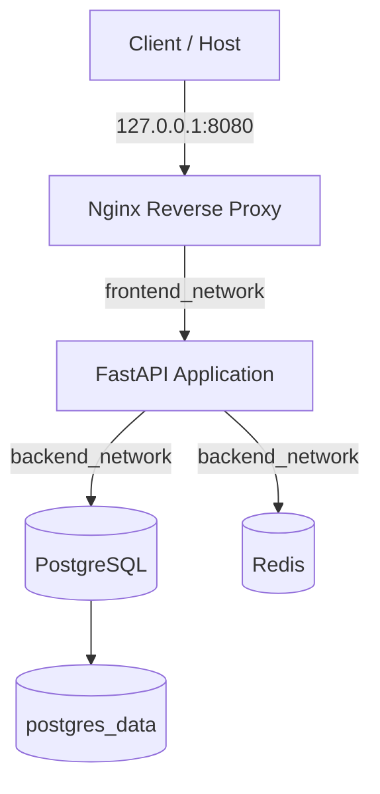

# Docker Task Platform

A production-like multi-container Docker project built to practice practical Docker and DevOps engineering concepts including image design, service discovery, persistent storage, runtime configuration, reverse proxying, health checks, network isolation, container security, and structured troubleshooting.

The application is a small FastAPI task service backed by PostgreSQL and Redis, with Nginx acting as the only external entry point.

## Architecture



### Network Layout

```text
frontend_network
Nginx <------> FastAPI

backend_network
FastAPI <----> PostgreSQL
FastAPI <----> Redis
```

Only Nginx publishes a port to the host.

```text
Host
 |
 | 127.0.0.1:8080
 v
Nginx
 |
 | frontend_network
 v
FastAPI
 |
 | backend_network
 +------ PostgreSQL
 |
 +------ Redis
```

FastAPI, PostgreSQL, and Redis are not directly published to the host.

## Components

| Component              | Responsibility                              |
| ---------------------- | ------------------------------------------- |
| Nginx                  | Reverse proxy and external entry point      |
| FastAPI                | Application API                             |
| PostgreSQL             | Persistent source of truth                  |
| Redis                  | Disposable application cache                |
| Docker Compose         | Multi-container configuration and lifecycle |
| Docker named volume    | PostgreSQL persistence                      |
| Docker bridge networks | Service discovery and network isolation     |

## Application Endpoints

```text
GET  /
GET  /health/live
GET  /health/ready
GET  /tasks
POST /tasks
```

`/health/live` checks whether the application process is alive.

`/health/ready` verifies that the application can reach its required PostgreSQL and Redis dependencies.

## Running the Project

Clone the repository and enter the project directory.

Create the local environment file:

```bash
cp .env.example .env
```

Edit `.env` and replace the placeholder password with a local development password.

Build and start the stack:

```bash
docker compose up -d --build
```

Check service status:

```bash
docker compose ps
```

All four services should eventually become healthy:

```text
nginx
app
db
redis
```

Test the application:

```bash
curl http://127.0.0.1:8080/
```

Check application readiness:

```bash
curl http://127.0.0.1:8080/health/ready
```

Create a task:

```bash
curl \
  -X POST \
  http://127.0.0.1:8080/tasks \
  -H "Content-Type: application/json" \
  -d '{"title":"Learn Docker networking"}'
```

List tasks:

```bash
curl http://127.0.0.1:8080/tasks
```

Stop and remove the containers and Compose networks:

```bash
docker compose down
```

The PostgreSQL named volume remains available.

> `docker compose down -v` also removes the PostgreSQL volume and therefore deletes persistent database data.

## Docker Design Decisions

### Nginx is the only published service

FastAPI is not directly exposed on the host.

External traffic follows:

```text
Client
  ↓
Nginx
  ↓
FastAPI
```

This prevents clients from bypassing the reverse proxy.

### Network isolation

Two user-defined bridge networks are used.

`frontend_network` is used only for communication between Nginx and FastAPI.

`backend_network` connects FastAPI to PostgreSQL and Redis.

Nginx has no direct network access to the data services.

### Docker DNS and service discovery

Container IP addresses are not hard-coded.

Services communicate through Docker DNS using Compose service names:

```text
app
db
redis
```

For example:

```text
DB_HOST=db
REDIS_HOST=redis
```

This avoids dependency on temporary container IP addresses.

### Persistent PostgreSQL storage

PostgreSQL stores its data in the Docker named volume:

```text
postgres_data
```

The volume lifecycle is independent from the PostgreSQL container lifecycle.

Database containers can therefore be recreated without losing the stored task data.

### Redis is disposable

Redis is used as a cache rather than the source of truth.

PostgreSQL stores persistent application data, so Redis can be recreated and repopulated without causing business-data loss.

### Runtime configuration

Runtime values are passed through environment variables.

The real `.env` file is excluded from Git.

The committed `.env.example` file documents the required configuration without containing real credentials.

### Health checks

The stack uses service-specific health checks:

```text
PostgreSQL → pg_isready
Redis      → redis-cli ping
FastAPI    → /health/ready
Nginx      → /nginx-health
```

This demonstrates the difference between:

```text
running
healthy
unhealthy
```

A running container is not necessarily a healthy service.

### Liveness vs readiness

FastAPI exposes separate health endpoints.

```text
/health/live
```

answers:

> Is the application process alive?

```text
/health/ready
```

answers:

> Can the application currently serve requests using its required dependencies?

For example, PostgreSQL can be unavailable while FastAPI remains alive.

### Restart policy

Services use:

```text
restart: unless-stopped
```

This helps recover containers whose main process exits unexpectedly.

A failed health check alone does not necessarily restart a running container.

### Non-root application

The FastAPI process runs as a dedicated non-root user instead of UID 0.

The application service also uses:

```text
no-new-privileges
```

as an additional container security control.

### Docker build cache

Dependencies are copied and installed before application source code:

```dockerfile
COPY app/requirements.txt .
RUN pip install --no-cache-dir -r requirements.txt
COPY app/ .
```

This allows Docker to reuse the dependency installation layer when only application source code changes.

### Multi-stage build decision

A multi-stage build was intentionally not added.

The project already uses `python:3.12-slim`, does not install a compiler or large build toolchain, and uses binary dependencies.

Adding another build stage would currently increase complexity without providing a meaningful size or security improvement.

## Persistence Model

PostgreSQL:

```text
Container
   |
   v
/var/lib/postgresql/data
   |
   v
postgres_data
```

Redis:

```text
Container
   |
   v
Temporary cache
```

Therefore:

```text
PostgreSQL = source of truth
Redis      = disposable cache
```

## Troubleshooting

The project includes controlled and real failure scenarios covering:

```text
Credential mismatch
Docker DNS / wrong service name
Database outage
Wrong application bind address
Host port conflict
Broken health check
Runtime network-state drift
```

All incidents were investigated using the same workflow:

```text
Symptom
   ↓
Hypothesis
   ↓
Evidence
   ↓
Narrow the Scope
   ↓
Root Cause
   ↓
Fix
   ↓
Verify
```

Detailed scenarios are documented in:

```text
docs/troubleshooting.md
```

## Useful Commands

View project containers:

```bash
docker compose ps
```

View all container states:

```bash
docker compose ps -a
```

Follow application logs:

```bash
docker compose logs -f app
```

Inspect Nginx logs:

```bash
docker compose logs nginx
```

Check Docker DNS:

```bash
docker compose exec app getent hosts db
```

Validate Nginx configuration:

```bash
docker compose exec nginx nginx -t
```

Inspect the frontend network:

```bash
docker network inspect docker-task-platform_frontend_network
```

Inspect the backend network:

```bash
docker network inspect docker-task-platform_backend_network
```

Inspect application health state:

```bash
docker inspect \
  --format '{{json .State.Health}}' \
  "$(docker compose ps -q app)"
```

List Docker volumes:

```bash
docker volume ls
```

Rebuild the application:

```bash
docker compose up -d --build app
```

Recreate a service from the current Compose desired state:

```bash
docker compose up -d --force-recreate nginx
```

## Git Workflow

The project was developed incrementally with Git.

The workflow included:

```text
Working Tree
    ↓
Staging Area
    ↓
Commit
    ↓
Repository History
```

Before important commits, staged changes were reviewed using:

```bash
git diff --cached
```

Commit messages describe meaningful project milestones rather than generic file updates.

## What I Learned

This project was designed to use Docker as an operational platform rather than only as an application packaging tool.

The main concepts practiced include:

Dockerfile design, images and containers, build context, image layers, build cache, `.dockerignore`, Docker Compose, service discovery, user-defined networks, network isolation, named volumes, persistence, environment variables, runtime configuration, reverse proxying, health checks, restart policies, non-root containers, port publishing, bind addresses, container lifecycle, logs, dependency management, Git workflows, and structured troubleshooting.

The project also demonstrated an important operational concept:

```text
Desired State
      ≠
Actual Runtime State
```

During a real failure, the Nginx container was no longer attached to the expected frontend Docker network even though the Compose configuration was correct.

Recreating the container from the Compose desired state restored its network membership and service discovery.
